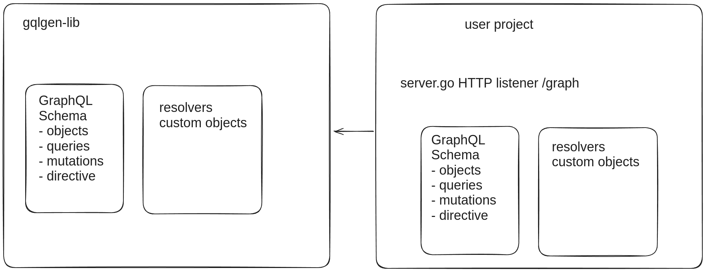

# Approaches to extending existing GraphQL Schema from a library

## Approach 1
Use builtin Plugin in `gqlgen` to intercept codegen lifecycle and generate:
- generated.go
- resolver.go
- schema.resolvers.go
- model/models_gen.go

which combiles the schema and implementation from the library and the schema and implementation coming from the user project.

### Pros
- very complicated and time consuming
- not tested yet: might not work due to unforseen blocker
- might require addition user config
### Cons
- very fine grained control over code generation

## Approach 2
In `server.go` setup 2 endpoints:
- /query
- /libquery
and configure the HTTP Listener with two handlers each for the respective endpoint. The handler, resolver and schema for `/libquery` will be reused from the library.

### Pros
- validated: works 100%
- very simple and fast
### Cons
- 2 endpoints instead of 1
- client need to be aware of the new endpoint

## Approach 3
In `server.go` start the HTTP Listener with custom handler function, which checks if the query is in the library or not and redirects handling to the respective handler. Similar to approach 2.

### Pros
- validated: works 100%
- very simple and fast
- keep the 1 endpoint `/query`
- client doesn't need change
### Cons
- the user extending the schema must change `server.go` (could be automated)

## Approach 4
New component - graphql gateway which proxies the queries/mutations to the appropriate endpoints and is aware of all schemas.

### Pros
- will definitely work
### Cons
- requires creation of entirely new component (graphql gateway)
- more complicated than 2 and 3, but probably not as complex as 1